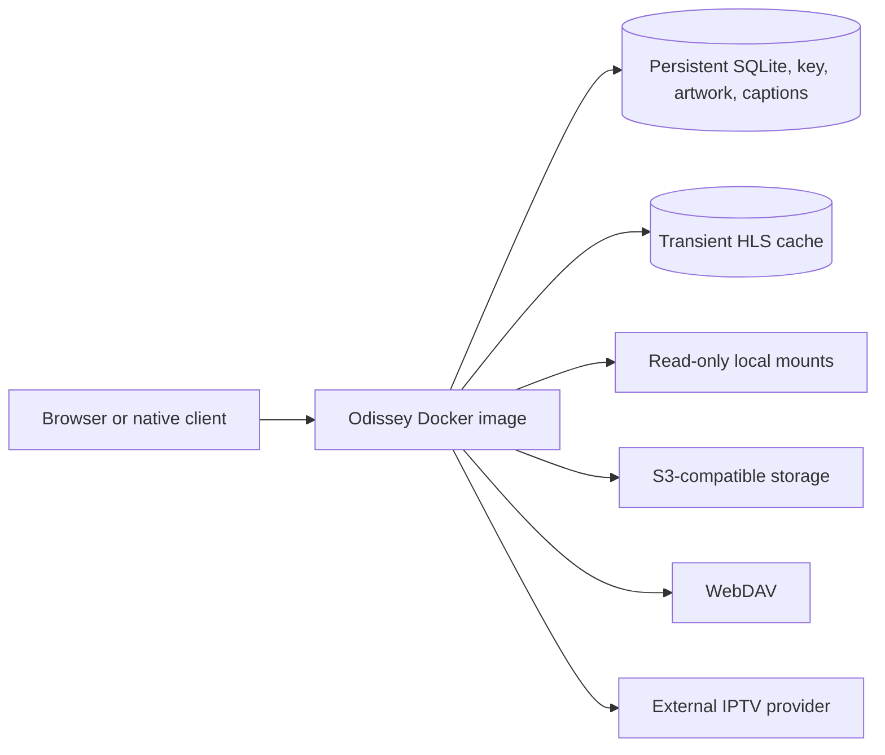

# Odissey

Odissey is an open-source, self-hosted media catalog and player for media
sources you already control. It combines a fast server-rendered web interface
with local, S3-compatible, WebDAV, and IPTV sources, and ships as one
self-contained Docker image.

The application uses Laravel, SQLite, Blade, HTMX, hls.js, and FFmpeg. Its
interface takes guidance from living-room media applications such as Plex
without copying their branding or assets.

> [!WARNING]
> Odissey is currently beta software. Keep verified backups and install an
> immutable release tag or full commit supplied by the maintainer. Do not use a
> moving `main` branch for an independent production installation.

> [!CAUTION]
> Odissey does not provide media, television channels, or an IPTV service.
> Connect only sources and providers you are authorized to use.

Odissey is an independent project and is not affiliated with Plex, TMDB,
TVmaze, IPTV-org, SubDL, OpenSubtitles, or any IPTV provider. Product and
service names identify compatible integrations only; their respective terms
and licenses still apply.

## What Odissey does

### Libraries and metadata

- Catalogs video and music from read-only local mounts, S3-compatible buckets,
  and WebDAV collections.
- Imports Xtream-compatible IPTV movies and series into the same Movies and TV
  Shows views as storage-backed media.
- Organizes movies, series, seasons, episodes, albums, and tracks with stable
  source identities.
- Extracts technical metadata and artwork with FFprobe and FFmpeg.
- Supports optional TMDB movie and series metadata plus free TVmaze series
  enrichment.
- Extracts embedded subtitles and can search SubDL and OpenSubtitles when
  free-account API keys are configured.
- Caches derived artwork and captions while leaving the original media in its
  source.

### Playback

- Direct-plays browser-compatible media with authenticated byte-range
  responses.
- Remuxes compatible streams to HLS when only the container is unsuitable.
- Transcodes incompatible video to bounded H.264/AAC HLS with FFmpeg.
- Uses a full-viewport player for movies, episodes, and Live TV.
- Preserves watched state, playback history, resume position, and the last
  viewed minute independently for every user.
- Provides user-owned music playlists.

### Live TV and IPTV

- Supports Xtream-compatible providers and generic M3U playlists with optional
  XMLTV guides.
- Imports channel groups, movies, series, and episodes without exposing
  provider credentials to the browser.
- Refreshes EPG data hourly and offers timeline-guide and channel-grid views.
- Maintains per-user channel favorites and playback history.
- Resolves channel logos against the public IPTV-org catalog instead of trusting
  provider-supplied icons.
- Proxies manifests, segments, redirects, and encryption-key resources through
  authenticated, short-lived sessions.

### Users and clients

- Requires a one-time setup token before the first administrator can be
  created on a production server.
- Disables public registration; administrators create and manage users.
- Makes configured libraries and IPTV providers available to every active user;
  it does not provide per-user source ACLs.
- Separates each user's favorites, history, progress, preferences, and native
  client sessions.
- Exposes a versioned `/api/v1` API for native clients with rotating,
  device-scoped sessions and short-lived playback grants.
- Provides the server API used by the separately developed
  [Odissey tvOS client](https://github.com/killer1loop/odissey-tvos).

## Current beta boundaries

| Area | Current behavior |
| --- | --- |
| Deployment | One container and one replica with SQLite on local storage |
| Web clients | Responsive web UI; direct-play support depends on the browser, container, and codecs |
| Transcoding | Software FFmpeg only, with one concurrent transcode by default |
| Native client | tvOS client is developed and released in a separate repository |
| IPTV | Xtream compatibility varies between providers |
| Not supported | Uploads, source-file management, DRM bypass, IPTV recording, catch-up TV, hardware acceleration, or multi-replica operation |

Before publishing a beta release, its release notes must identify the server
architecture, browsers, and devices on which that exact image was tested.

## Technology

| Layer | Components |
| --- | --- |
| Application | Laravel 13, PHP 8.3+ |
| Interface | Blade, HTMX 2, Tailwind CSS 4, Vite 8 |
| Playback | hls.js, FFmpeg, FFprobe |
| Persistence | SQLite in WAL mode |
| Container runtime | FrankenPHP, Supervisor, finite role-separated workers |
| Native API | Versioned JSON API with an OpenAPI contract |



Odissey does not upload, overwrite, or delete source media. The persistent
application volume contains the SQLite database, generated application key,
metadata, cached artwork, and cached captions. FFmpeg HLS output and
seek-dependent source snapshots are transient and belong on bounded disposable
local disk storage.

Odissey contains no application analytics or telemetry. It makes outbound
requests only to operator-configured storage and IPTV endpoints, optional
metadata and caption services, and the IPTV-org channel/logo catalogs.

## Production requirements

The supplied Docker Compose deployment targets one Odissey container on one
server:

- 64-bit Linux on `amd64`; `arm64` remains experimental until the selected
  release explicitly records a successful ARM64 image test;
- a current Docker Engine and Docker Compose plugin;
- `git`, `curl`, `openssl`, and `unzip`;
- four CPU cores and 12 GiB host RAM recommended;
- at least 20 GiB free disk in addition to source media;
- local block storage for the persistent Docker volume;
- a domain pointing to the server;
- an HTTPS reverse proxy with TCP ports 80 and 443 available.

Use exactly one application replica. SQLite must remain on local block storage;
do not place `/var/lib/odissey` on NFS or another network filesystem.

## Install with Docker Compose

### 1. Check out an immutable release

```sh
git clone https://github.com/killer1loop/odissey.git
cd odissey
git fetch --tags
RELEASE="<release-tag-or-full-commit-from-the-maintainer>"
git checkout --detach "$RELEASE"
git rev-parse HEAD
```

Record the full commit returned by `git rev-parse HEAD`.

### 2. Create the private runtime configuration

```sh
cp .env.docker.example .env.docker
chmod 600 .env.docker
openssl rand -hex 32
```

Edit `.env.docker` and set:

```dotenv
APP_URL=https://media.example.com
SESSION_SECURE_COOKIE=true
ODISSEY_SETUP_TOKEN=<the-64-character-value-generated-above>
ODISSEY_RELEASE=<the-full-commit-returned-by-git-rev-parse>
```

Never commit or send `.env.docker`. The example deliberately uses local HTTP,
non-secure cookies, and an empty setup token so an unedited copy cannot expose
a claimable administrator account.

The default profile limits the container to four CPUs and 8 GiB RAM. Transcode
segments and seek-dependent remote source snapshots use bounded disposable
container storage rather than RAM-backed tmpfs, which keeps large movies from
exhausting the memory limit.

### 3. Build and start

```sh
docker compose --env-file .env.docker build --pull
docker compose --env-file .env.docker up -d \
  --wait --wait-timeout 180
docker compose --env-file .env.docker ps
```

Verify the application and its supervised processes:

```sh
curl --fail http://127.0.0.1:8000/up
docker compose --env-file .env.docker exec -T app \
  supervisorctl -c /etc/supervisor/conf.d/odissey.conf status
```

The health request must return HTTP 200 and all 14 Supervisor processes must
report `RUNNING`.

The Compose service publishes `8000` only on `127.0.0.1`. Do not change it to a
public host binding; place an HTTPS reverse proxy in front of it.

### 4. Configure HTTPS

A minimal host-level Caddy configuration is:

```caddyfile
media.example.com {
    reverse_proxy 127.0.0.1:8000
}
```

Replace the hostname with the hostname in `APP_URL`, then validate and reload
Caddy:

```sh
sudo caddy validate --config /etc/caddy/Caddyfile
sudo systemctl reload caddy
```

An existing Traefik or Dokploy installation may route HTTPS to internal port
`8000` instead. Keep one replica, attach a persistent volume at
`/var/lib/odissey`, use stop-first replacement semantics, and do not publish an
additional public host port. Set `ODISSEY_RELEASE` to the full deployed commit
and verify that it changes with every automatic deployment.

Reverse proxies and log collectors must redact or exclude
`/api/v1/playback/assets/*` from access logs. These paths contain short-lived
native playback grants.

### 5. Create the first administrator

Open:

```text
https://media.example.com/setup
```

Enter the one-time setup token and create the first administrator. Confirm that
you can sign out and sign in again. The setup route closes permanently after
the first account is created.

Clear the token in `.env.docker`:

```dotenv
ODISSEY_SETUP_TOKEN=
```

Recreate and verify the container:

```sh
docker compose --env-file .env.docker up -d \
  --wait --wait-timeout 180
curl --fail http://127.0.0.1:8000/up
```

## Configure media sources

Source and integration credentials are entered through the authenticated
administration interface and stored encrypted.

| Source | Configuration |
| --- | --- |
| Local | A read-only container path below `/media` |
| S3-compatible | HTTPS endpoint, bucket, optional prefix, region, read-only access key and secret |
| WebDAV | Full collection URL and a read-only account |
| Xtream IPTV | Base URL, username, password, and provider connection limit |
| Generic IPTV | M3U playlist URL, optional XMLTV URL, and connection limit |

### Local media mounts

Create `compose.override.yaml` beside `compose.yaml`:

```yaml
services:
  app:
    volumes:
      - /srv/media:/media:ro
```

`compose.override.yaml` is ignored by this repository and loaded automatically
by Docker Compose. Recreate the service:

```sh
docker compose --env-file .env.docker up -d \
  --wait --wait-timeout 180
```

The host directory must be readable by container UID/GID `33` and must remain
read-only. Add paths such as `/media/movies` or `/media/music` under
**Administration → Media sources**.

### S3-compatible storage

Use a dedicated identity limited to:

- `s3:ListBucket` for the selected bucket and prefix;
- `s3:GetObject` below that prefix.

Odissey uses path-style requests in the form
`<endpoint>/<bucket>/<object-key>`. The endpoint field must not include the
bucket name.

### WebDAV

Enter the complete collection URL, including the desired collection path.
The server must support depth-one `PROPFIND` and ranged `GET` requests. Enable
private-network access only for a deliberately selected LAN endpoint.

### Metadata and captions

Open **Administration → Integrations** to configure:

- an optional TMDB read token;
- an optional SubDL API key;
- an optional OpenSubtitles API key;
- preferred caption language codes.

TVmaze series enrichment requires no API key. Embedded subtitle extraction
does not require a caption provider.

### IPTV

Open **Administration → IPTV providers** and select either Xtream-compatible or
generic M3U/XMLTV. Plain HTTP exposes provider credentials and streams in
transit; accept the HTTP warning only when the provider offers no HTTPS
endpoint and the risk is understood.

EPG refresh runs hourly. A completely empty replacement catalog, category list,
series, or guide is rejected when established data exists. A syntactically
valid but truncated non-empty provider response cannot always be distinguished
from a legitimate catalog removal, so investigate unexpected large item drops
and keep a recent backup.

Remote S3/WebDAV technical probing is deliberately bounded. Media is still
cataloged when probing is deferred or cannot identify a format, but Odissey may
conservatively select HLS conversion instead of direct play.

## Persistent data and backups

The named `odissey-data` volume is mounted at:

```text
/var/lib/odissey
```

It contains the SQLite database, its WAL/SHM neighbors, the generated
application key, cached artwork, and cached captions. Persist the complete
directory, not only `database.sqlite`.

The named volume is initialized by Docker. If it is replaced with a host bind
mount, the directory must be writable by container UID/GID `33`.

`docker compose down` retains the volume. **Do not run
`docker compose down -v` on a server containing Odissey data.**

Create a portable backup before every upgrade:

```sh
sudo install -d -m 0700 -o "$(id -u)" -g "$(id -g)" \
  /srv/odissey-backups
BACKUP_FILE="/srv/odissey-backups/odissey-$(date -u +%Y%m%dT%H%M%SZ).zip"
docker compose --env-file .env.docker exec -T app \
  php artisan odissey:backup /tmp/odissey-backup.zip
docker compose --env-file .env.docker cp \
  app:/tmp/odissey-backup.zip "$BACKUP_FILE"
chmod 600 "$BACKUP_FILE"
unzip -t "$BACKUP_FILE"
docker compose --env-file .env.docker exec -T app \
  rm -f /tmp/odissey-backup.zip
```

The archive contains the database and application key and therefore exposes
all stored source credentials. Move it to encrypted off-host storage. Use the
complete offline restore procedure in
[Beta installation and operations](docs/BETA_INSTALLATION.md#8-restore-or-roll-back);
do not restore only the database or run old application code against a newer
database.

## Upgrade

1. Create and verify a portable backup.
2. Record the current full commit.
3. Fetch and check out the new immutable tag or commit.
4. Update `ODISSEY_RELEASE` in `.env.docker` to the new full commit.
5. Build and recreate the single container.

```sh
git fetch --tags
NEW_RELEASE="<new-release-tag-or-full-commit>"
git checkout --detach "$NEW_RELEASE"
git rev-parse HEAD
# Put the full commit above into ODISSEY_RELEASE in .env.docker.
docker compose --env-file .env.docker build --pull
docker compose --env-file .env.docker up -d --remove-orphans \
  --wait --wait-timeout 180
curl --fail http://127.0.0.1:8000/up
```

After an upgrade, verify login, one direct-play item, one converted HLS item,
one Live TV channel, EPG data, and resume progress. Rollback requires the
matching application commit, database, and encryption key described in the
beta operations guide.

## Operational checks

```sh
docker compose --env-file .env.docker ps
docker compose --env-file .env.docker logs --tail=200 app
docker compose --env-file .env.docker exec -T app php artisan migrate:status
docker compose --env-file .env.docker exec -T app php artisan schedule:list
docker compose --env-file .env.docker exec -T app ffmpeg -version
docker compose --env-file .env.docker exec -T app \
  sqlite3 /var/lib/odissey/database.sqlite \
  'PRAGMA integrity_check; PRAGMA journal_mode; PRAGMA foreign_key_check;'
```

Expected SQLite output begins with `ok` and `wal`, with no foreign-key rows.

For support reports, include the exact Odissey commit, host architecture,
Docker and Compose versions, reproduction steps, and short redacted logs.
Never share `.env` files, source credentials, private URLs, databases, backup
archives, application keys, or native playback asset paths.

## Local development

Requirements:

- PHP 8.3–8.5;
- Composer 2;
- Node.js 24;
- SQLite;
- PHP extensions for cURL, Intl, Mbstring, PCNTL, PDO SQLite, SQLite3, XML, and
  ZIP;
- FFmpeg and FFprobe for media playback tests.

Install and start the development processes:

```sh
composer setup
composer dev
```

Open [http://localhost:8000](http://localhost:8000). Development and test
environments allow local first launch without a production setup token.
`composer dev` runs the web application, Vite, logs, and the interactive queue;
it does not reproduce every role-separated media worker. Use the Docker
deployment when validating complete scanning, IPTV VOD, enrichment, or
transcoding behavior.

Run the project checks:

```sh
composer validate --strict
vendor/bin/pint --test
composer test
npm run build
composer audit --locked
npm audit
```

Generate disposable synthetic playback fixtures for an existing user:

```sh
php artisan media:e2e:generate viewer@example.test --duration=30
php artisan media:e2e:clean
```

Both fixture commands require `--force` in production.

## Security

- Use HTTPS for the application and source endpoints.
- Give Odissey read-only, prefix-scoped storage credentials.
- Never put credentials in image build arguments or Git.
- Keep the setup token private and clear it after first-admin creation.
- Treat playback-grant URLs and portable backups as secrets.
- Keep the persistent volume on local storage and back it up before changes.
- Rotate any credential used during public demonstrations or shared testing.

Report vulnerabilities using the private instructions in
[SECURITY.md](SECURITY.md), not a public issue. General beta defects can use the
[beta bug report](https://github.com/killer1loop/odissey/issues/new/choose)
after all logs and reproduction details have been redacted.

## Documentation

- [Beta installation and operations](docs/BETA_INSTALLATION.md)
- [Deployment reference](docs/DEPLOYMENT.md)
- [Architecture](docs/ARCHITECTURE.md)
- [Security model](docs/SECURITY.md)
- [Metadata and captions](docs/METADATA.md)
- [Native API OpenAPI contract](docs/openapi/native-v1.yaml)
- [Implementation plan](docs/IMPLEMENTATION_PLAN.md)
- [Contributing](CONTRIBUTING.md)
- [Changelog](CHANGELOG.md)

## Contributing

Pull requests are welcome. Keep fixtures synthetic, never commit provider or
storage credentials, and run the project checks before submitting a change.
See [CONTRIBUTING.md](CONTRIBUTING.md).

## License

Odissey is released under the [MIT License](LICENSE).
