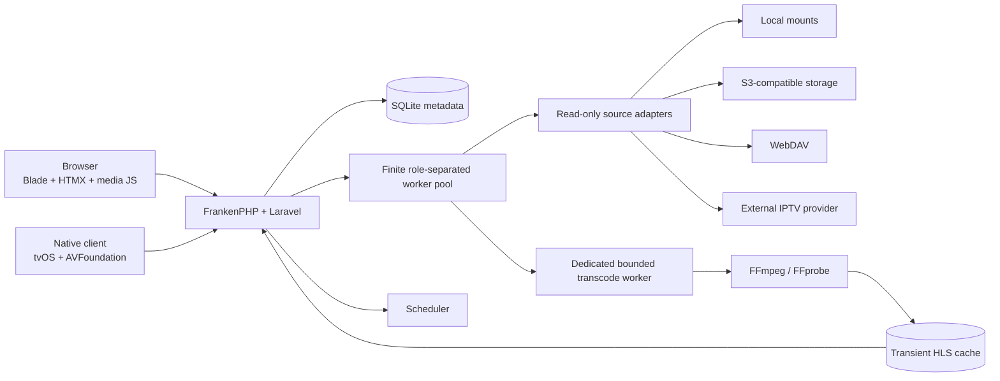

# Architecture

## System boundary

Odissey catalogs and plays media from external, read-only sources. It does not
offer uploads, recordings, source-file copies, or write operations against a
media source.

The persistent application volume contains:

- SQLite metadata and user state;
- an application encryption key when one is not supplied externally;
- no source media.

FFmpeg necessarily produces manifests and segments for HLS playback. Those
files are transient derivatives held in a size-limited cache or tmpfs, scoped to
an authenticated stream session, and removed after expiry.



The Docker image supervises the web process, a finite role-separated worker
pool, and the scheduler. Source discovery is serial per source; two bounded
workers process media objects and two bounded workers handle metadata and
caption enrichment. Long-running conversions use a dedicated single-purpose
queue connection so they cannot block interactive or catalog jobs. The media
supervisor owns stale-session cleanup and cache pruning.

## Request and job model

Blade renders complete pages. HTMX replaces bounded fragments for operations
such as filters, guide windows, favorites, provider sync progress, and search.
Every URL remains usable as a normal HTTP request, and server responses decide
redirects and authorization.

Finite work runs on the database queue:

- provider connectivity and channel/category synchronization;
- bounded hourly EPG refresh for every enabled provider;
- library scans;
- `ffprobe` analysis;
- cleanup and retention tasks.

Network reads and XML parsing happen outside database transactions. Imports
commit bounded, idempotent batches and hold a per-source lock. Jobs contain
record identifiers, not credentials.

Storage discovery runs on one bounded queue and fans supported objects out to
two media processors. Scan tokens claim one attempt end to end, so a replacement
scan can safely ignore stale discovery and object jobs. Startup requeues
interrupted claims, while the parallel-scan schema upgrade forces one complete
rebuild of pre-upgrade local, S3, and WebDAV catalogs.

Xtream top-level movie and series discovery remains bounded in the provider
sync, then four dedicated IPTV VOD workers fetch series details in parallel.
The IPTV media source records discovered, processed, and failed series counts;
an import token makes jobs from a superseded catalog refresh safe no-ops. The
parallel-VOD upgrade queues one complete provider refresh at container startup.
SQLite uses WAL plus immediate transactions so concurrent queue reservations
wait for the single writer instead of failing during read-to-write promotion.
Automatic caption jobs are emitted only when a caption provider is configured.

## Native client boundary

The versioned `/api/v1` JSON API is an additional presentation layer over the
same user-scoped catalog, Live TV, playback, and administration services used
by the web application. Its OpenAPI contract is
[`docs/openapi/native-v1.yaml`](openapi/native-v1.yaml). The server-discovery
endpoint is public; setup, login, and token refresh have narrowly scoped public
routes, and all other user operations require a native bearer session.

Each app installation creates an independently revocable
`native_client_session`. Access and refresh tokens are random opaque values;
only their hashes are persisted, and token hashes are excluded from model
serialization. Access tokens are short lived. A successful refresh consumes and
records the prior refresh-token hash, rotates both tokens, and treats replay of
a consumed token as compromise of that device session. Session and audit
retention are bounded by configuration and the scheduled native-client pruning
command.

AVFoundation cannot attach the JSON API authorization header to every nested
HLS request. Playback resolution therefore returns a resource-scoped grant in
the playback path. The server stores only the grant hash, binds it to the user,
native session, resource, and delivery mode, and limits it to at most ten
minutes or the remaining refresh-session lifetime. Re-resolving the same
resource for the same client session revokes the earlier grant; the native
client resolves again before expiry. These URLs are credentials: HTTP access
logs must redact or exclude `/api/v1/playback/assets/*`.

Native music playlists are persistent, ordered, and owned by one user. Writes
are request-throttled, serialized per owner across processes, capped at 1,000
tracks, and performed in short SQLite transactions. An update that supplies the
existing ordered track IDs does not delete and recreate item rows.

## Source contracts

### Media sources

All storage drivers implement a read-only contract:

```text
list(path, cursor)
stat(locator)
openRange(locator, start, end)
capabilities()
```

- **Local:** configured roots must be mounted read-only. Canonical-path checks
  prevent traversal and symlink escape.
- **S3:** use a prefix-scoped, read-only identity. Direct play may use a
  short-lived signed URL when doing so does not expose source credentials.
- **WebDAV:** use a read-only account. Onboarding uses depth-one `PROPFIND` and
  a ranged `GET` because seeking support varies by server.
- **IPTV VOD:** Xtream movie and episode identifiers are stored as encrypted
  opaque locators on a provider-managed media source. Credentials remain on
  the encrypted provider record and playback is proxied through the same
  authenticated range/transcode boundary.

The catalog stores stable external locators and metadata. It never stores the
source bytes.

### IPTV providers

The implemented adapter normalizes an Xtream-style API into the following
domain objects; generic M3U/XMLTV support will implement the same contract:

- provider;
- channel group;
- channel;
- EPG channel mapping;
- EPG program.
- VOD movie, series, and episode.

The IPTV-first flow is:

1. An admin enters a display name, base URL, username, and password.
2. The server validates the URL and tests authentication asynchronously.
3. Live categories/channels and on-demand movies/series are upserted by stable
   provider identifiers.
4. Current/next guide rows are fetched with bounded short-EPG requests and
   normalized to UTC. A streaming XMLTV importer is planned.
5. Missing channels become inactive instead of being deleted.
6. Users filter by provider/group and maintain their own favorites.

Provider channel icon URLs are deliberately ignored. Odissey resolves channel
identity against the public IPTV-org channel and logo catalogs using an exact
EPG channel ID first, then unique country-aware name aliases after removing
display-only quality suffixes. Only active HTTPS raster logos are eligible;
ambiguous or unmatched channels render local initials. The catalog is bounded,
cached, refreshed daily, and failures preserve the last approved match.

Origin URLs and credentials must never enter HTML, HLS playlists, logs, queue
payloads, or browser network requests. Playback uses an opaque, short-lived
stream session. Provider manifests, segments, redirects, and encryption-key URLs
are fetched through the authenticated server boundary.

## Playback decision

For each playable item:

1. **Direct play** when the browser supports the container/codecs and the source
   provides reliable byte ranges.
2. **Remux to HLS** with stream copy when only the container is incompatible.
3. **Transcode to H.264/AAC HLS** when codecs, bitrate, resolution, or subtitles
   require conversion.

FFmpeg is executed with an argument array, never a shell command. Protocols,
threads, resolution, bitrate, concurrent sessions, scratch bytes, and lifetime
are bounded. Remote media reaches FFmpeg through a short-lived signed loopback
route backed by the validated source adapter, so credentials and upstream URLs
never enter FFmpeg arguments or browser responses. The session becomes playable
as soon as the first complete HLS segment is present; conversion continues on
the dedicated worker. Signed segment routes verify the user and session before
serving transient output.

The browser sends a sequenced playback heartbeat every 10–15 seconds and on
pause, seek, completion, and page exit. The server upserts the current resume
row and rejects out-of-order updates; it does not append a history row for every
heartbeat.

Movie and episode playback uses the same full-viewport shell as Live TV. The
server renders a user-scoped recent-history rail with resume percentages and
remaining time; the browser updates the active row as playback advances.
Fullscreen is available from the persistent control bar or the `F` key, with
WebKit video fullscreen as a fallback.

## Core data model

| Table | Purpose and important constraints |
| --- | --- |
| `users` | Role, preferences, timezone; public registration is disabled. |
| `storage_sources` | Type, display name, encrypted configuration, allowed prefix/root, capabilities, sync state. |
| `libraries` | A named video or music catalog backed by one source. |
| `media_items` | Normalized movie, episode, track, album, or other metadata. |
| `media_files` | Stable external locator, size, modified time, probe result, and media-item link. |
| `iptv_providers` | Encrypted provider settings, protocol, health, and sync state. |
| `channel_groups` | Provider category with stable external identifier and ordering. |
| `channels` | Provider channel, group, EPG mapping, logo URL, and active flag. |
| `epg_sources` | Guide source, refresh policy, last result, and retention settings. |
| `epg_programs` | UTC start/end, title, description, category; indexed by channel and time. |
| `channel_favorites` | Unique `(user_id, channel_id)`. |
| `playback_sessions` | One row per play with user, playable, start/end, mode, and sanitized outcome. |
| `playback_progress` | Unique user/playable resume state in integer milliseconds plus monotonic sequence. |
| `stream_sessions` | Opaque ID, owner, source/playable, mode, lease, heartbeat, expiry, and sanitized error. |
| `sync_runs` | Observable status and counts for provider/library background work. |
| `native_client_sessions` | One independently revocable device installation with hashed rotating access and refresh credentials. |
| `native_refresh_token_uses` | Bounded hashes of consumed refresh tokens used to detect replay within a device session. |
| `native_playback_grants` | Short-lived, hashed, resource-scoped credentials for AVFoundation media requests. |
| `admin_audit_events` | Bounded native administrative activity without secrets or credential payloads. |
| `music_playlists` / `music_playlist_items` | User-owned playlists and their unique ordered media-item membership. |

Live channels have playback history and watched duration but no resume position.
Resume applies to on-demand video, music, and any later catch-up/VOD support.

## SQLite discipline

SQLite is appropriate for the intended self-contained, single-replica
deployment:

- local persistent volume, never NFS or another network filesystem;
- WAL journal mode;
- foreign keys enabled;
- five-second busy timeout;
- short transactions and chunked EPG upserts;
- fixed, bounded background-worker roles with two media processors and two
  enrichment processors;
- periodic checkpoint, integrity check, and retention cleanup.

Backups use SQLite's online backup API or `VACUUM INTO`. Copying only a live
database file can omit WAL state. The application key must be backed up with the
database or encrypted source settings cannot be recovered.

Native-client support is introduced by additive migrations. The upgrade creates
new session, grant, refresh-use, audit, and playlist tables and adds native
delivery/track-selection columns to transcode sessions; it does not replace or
rewrite existing users, catalogs, history, or playback progress. As with every
release, back up SQLite and the application key before starting an image that
runs pending migrations.

## Interface architecture

The visual direction takes guidance from Plex's documented patterns without
copying branding or assets:

- a stable dark app shell with source navigation and prominent search;
- home shelves for continue-watching, recently added, favorites, and live now;
- source-level tabs for recommendations, browse, categories, and collections;
- poster-first detail pages with a clear play/resume action;
- a responsive timeline EPG with sticky playable channels, current-time
  markers, group/favorites filters, and an alternate channel-card grid;
- a persistent mini-player for music.

Relevant research:

- [Plex interface overview](https://support.plex.tv/articles/200484203-interface-overview/)
- [Customizing Plex Web](https://support.plex.tv/articles/customizing-plex-web/)
- [Plex library view](https://support.plex.tv/articles/200392126-using-the-library-view/)
- [Plex program guide](https://support.plex.tv/articles/225877387-program-guide/)
- [Plex web player](https://support.plex.tv/articles/200392226-plex-web-app-player/)

Hover shortcuts always have keyboard and touch equivalents. HTMX swaps restore
focus where appropriate and announce errors. The EPG follows the
[WAI-ARIA grid pattern](https://www.w3.org/WAI/ARIA/apg/patterns/grid/), player
controls have visible focus and large targets, and motion respects
`prefers-reduced-motion`.
